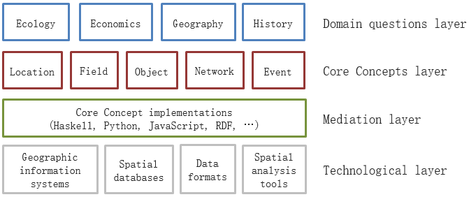

Core Concepts of Spatial Information
=============================================
*Abstract:* This repository contains the specifications and resources towards a language for spatial computing.
The goal of this work is to provide a high-level language for spatial computing that is executable
on existing commercial and open source spatial computing platforms,
particularly Geographic Information Systems (GIS).
The key idea of the approach is to target an abstraction level higher
than that of GIS commands and data formats, yet meaningful within and across
application domains. The paper describes the underlying theory of spatial
information and shows its evolving formal specification. An embedding in Python
exemplifies access to commonly available implementations of spatial computations.
For details, see references (Kuhn 2012; Kuhn & Ballatore 2015).

*Keywords:* spatial computing; domain-specific languages; geographic information science

Members & contributors:
* Prof. **Werner Kuhn** ([home](http://geog.ucsb.edu/~kuhn))
* Dr. **Andrea Ballatore** ([home](http://sites.google.com/site/andreaballatore))
* Eric Ahlgren
* Marc Thiemann
* Michel Zimmer ([home](https://www.mzimmer.net))

Architecture
----------------------

Contents
----------------------
- `CoreConceptsHs`: The Haskell specifications of the core concepts.
- `CoreConceptsPy`: A Python implementation of the core concepts.
- `CoreConceptsRdf`: An RDF(S) implementation of the core concepts.

Status
------
Haskell: Locations, fields, networks, objects and events are specified. Only networks are implemented. No unit tests exist yet. Only networks have examples.

Python: Locations, fields, networks, objects and events have an abstract class. Except locations all of them have an implementation. Unit tests exist for everything except locations, but the tests for fields and objects should not be considered full unit tests and are more like examples. Only events and networks have examples.

RDF: Two thorough ontologies written in owl and one basic ontology written in RDFS for the event core concept. For every event ontology there are use cases including example RDF data and SPARQL queries. Apart from that, there is a basic, preliminary ontology written in RDFS for all core concepts.
There are still thorough ontologies needed for the core concepts location, field, network and object.

TODO
----
- [Haskell] Rewrite NetworkImpl.Edge as a combination of ID, source, target and weight

Misc
----------------------
- [How to contribute](CONTRIBUTING.md)

References
----------
- Kuhn, W. & Ballatore, A. (2015). *Designing a Language for Spatial Computing.* AGILE 2015, Lisbon, Portugal [in press]
- Kuhn, W. (2012). *Core concepts of spatial information for transdisciplinary research.* International Journal of Geographical Information Science, 26(12), 2267-2276. <[PDF](http://ifgi.uni-muenster.de/~kuhn/research/publications/pdfs/refereed%20journals/IJGIS%202012.pdf)>
